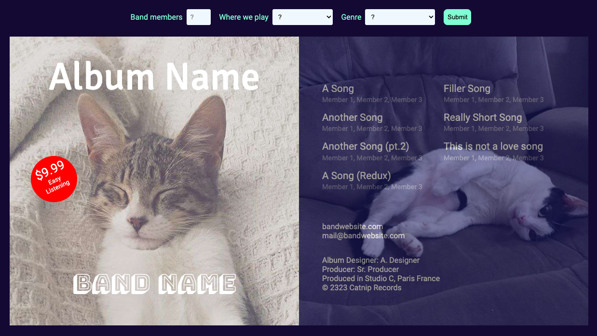

# Critical Web Design 

A collection of examples and exercises to accompany *Critical Web Design* by xtine burrough and Owen Mundy.

**Chapter 1 - Networks**

Publish your first web page: By the end of the modules in this chapter you will create and publish your first web page. Starting with the next exercise, you will create your Sites folder in your home directory and use the command line to navigate your hard drive in Terminal or Git Bash.

 

**Chapter 2 - View Source**

Design a concrete poem: Throughout the modules in this chapter you will create a concrete poem that you pre-visualize and design in your favorite GUI (graphical user interface) and then code for the web browser using HTML, CSS, and Javascript. Start by choosing a single word or important phrase from one of the texts at designmanifestos.org. Select a phrase that speaks to you. You may want to preview the examples we created at the end of the chapter.

     

**Chapter 3 - Critical Design**

Create a work of critical web design: Throughout the modules in this chapter you will redesign a logo to create a visual form incorporating commentary. You will then use Figma to iterate on design, consider typographic choices using Google Fonts, and create a web page with interactive images and Javascript to express your ideas. 

    

Chapter 4 - On the Grid

   

Chapter 5 - Usability & Interactions

  

Chapter 6 - Off the Grid

   

Chapter 9 - Generative Design

 
