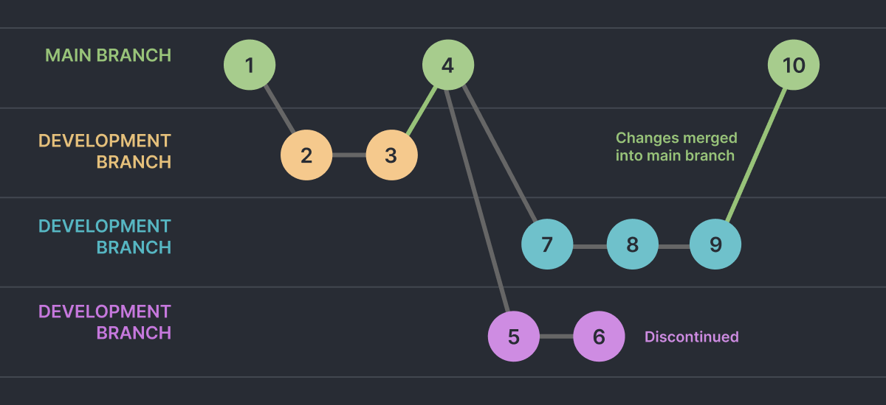
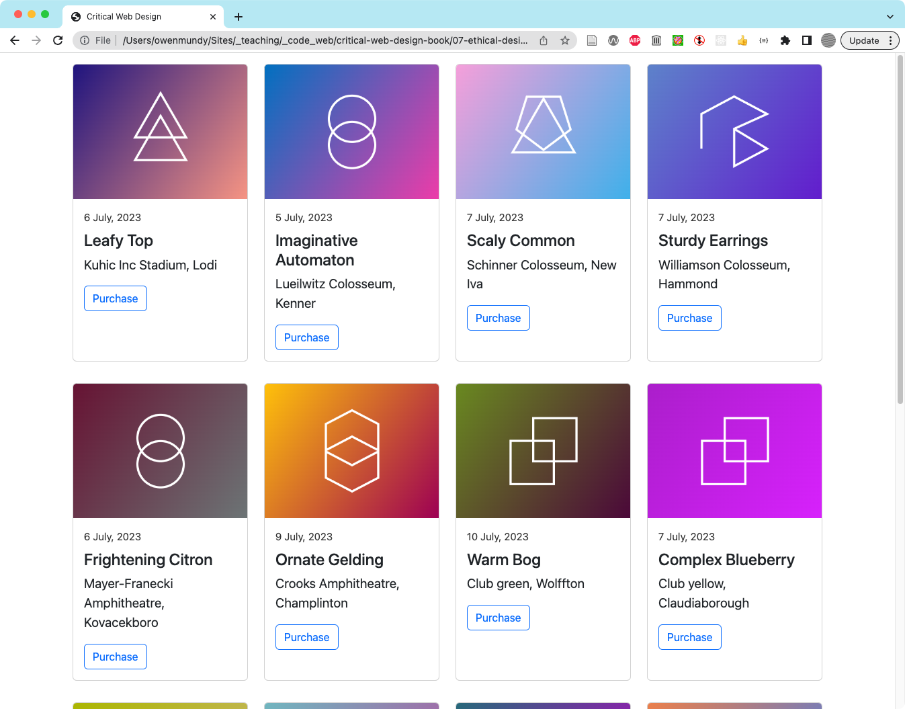
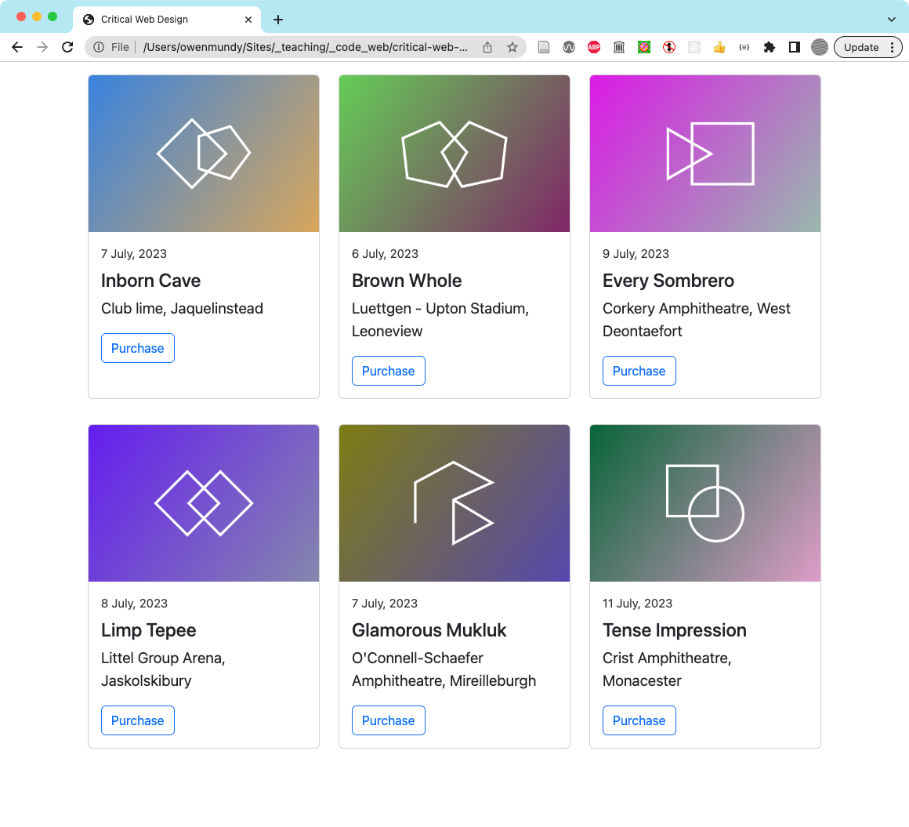
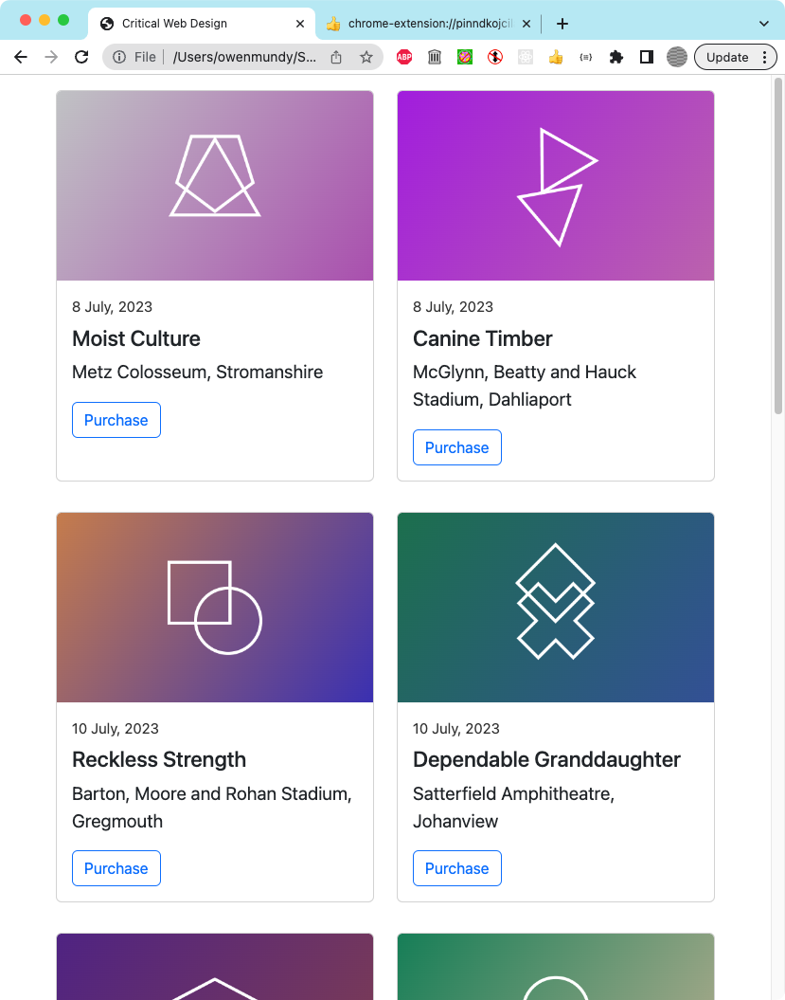

# Critical Web Design

A collection of examples and exercises to accompany _Critical Web Design_ by xtine burrough and Owen Mundy.

## Chapter 1 - Networks

Publish your first web page: By the end of the modules in this chapter you will create and publish your first web page. Starting with the next exercise, you will create your Sites folder in your home directory and use the command line to navigate your hard drive in Terminal or Git Bash.

 

## Chapter 2 - View Source

Design a concrete poem: Throughout the modules in this chapter you will create a concrete poem that you pre-visualize and design in your favorite GUI (graphical user interface) and then code for the web browser using HTML, CSS, and Javascript. Start by choosing a single word or important phrase from one of the texts at designmanifestos.org. Select a phrase that speaks to you. You may want to preview the examples we created at the end of the chapter.

   

## Chapter 3 - Critical Design

Create a work of critical web design: Throughout the modules in this chapter you will redesign a logo to create a visual form incorporating commentary. You will then use Figma to iterate on design, consider typographic choices using Google Fonts, and create a web page with interactive images and Javascript to express your ideas.

   

## Chapter 4 - On the Grid

Design a responsive multi-column layout for a fake newspaper web page. Use lorem ipsum placeholder text throughout your design. Code the page using the Bootstrap framework.

  

## Chapter 5 - Usability & Interactions

Create and implement a usability test, then design a responsive web page to reflect on findings. Evaluate your design using the "less is more" critique. Code the design using bootstrap, including a working web form to output the score from the System Usability Scale (SUS) survey.

 

## Chapter 6 - Off the Grid

  

## Chapter 7 - Ethical Design

    

## Chapter 8 - Generative Design

This chapter prompt leads you to continue the work in chapter 7 by designing and coding an interactive album generator application. These exercises model the generative design prompt that follows at the end of the chapter: to create a web page that can generate new iterations of itself based on some changeable data source, like user input, time, location, etc.

