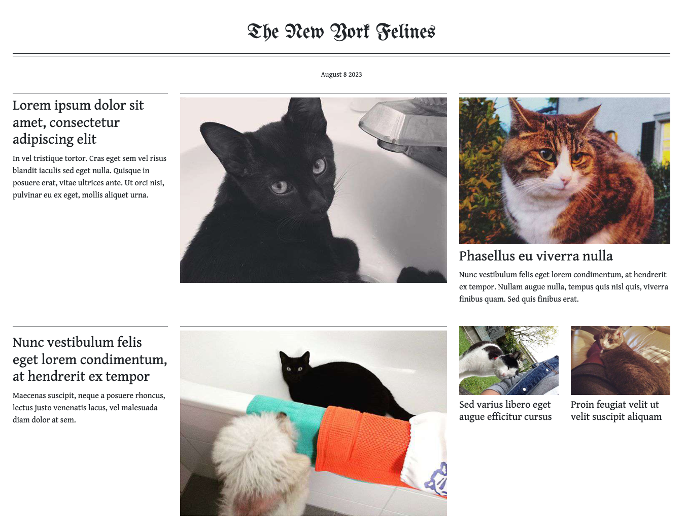
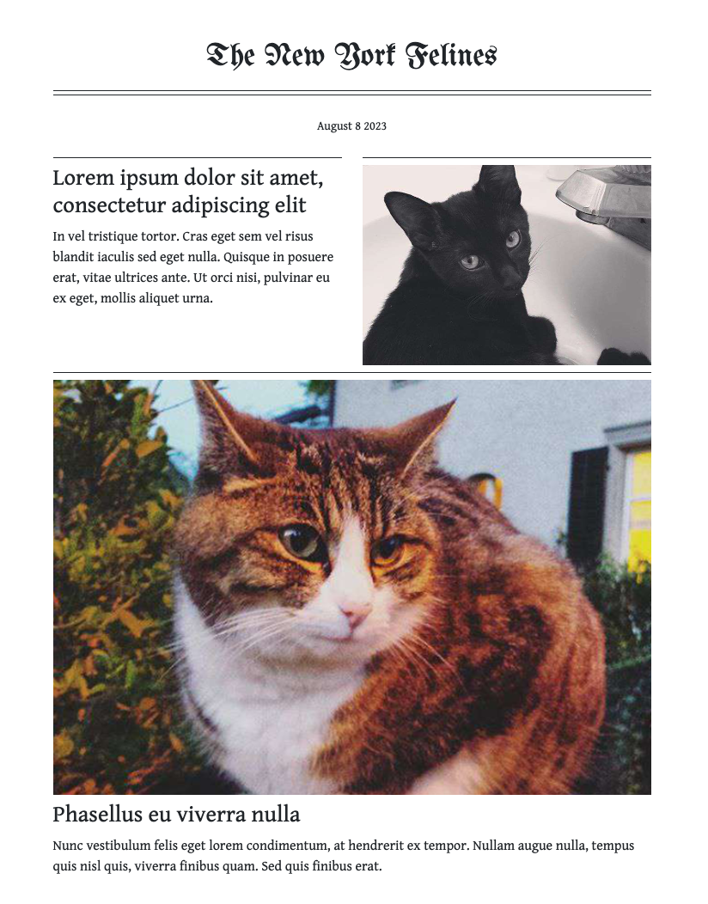
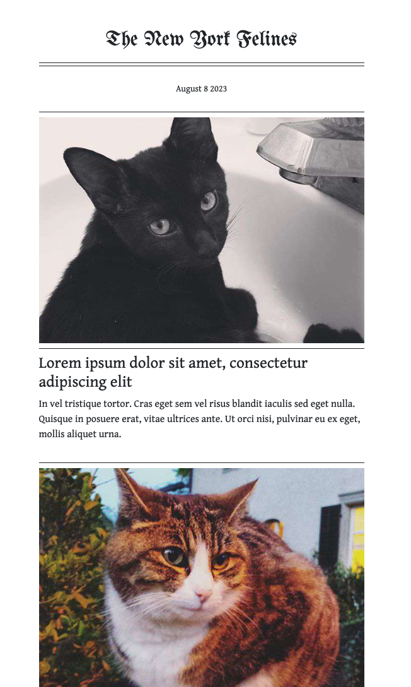

# Critical Web Design 

A collection of examples and exercises to accompany *Critical Web Design* by xtine burrough and Owen Mundy.

Chapter 1 - Networks

 

Chapter 2 - View Source

     

Chapter 3 - Critical Design

    

Chapter 4 - On the Grid

   

Chapter 5 - Usability & Interactions

  

