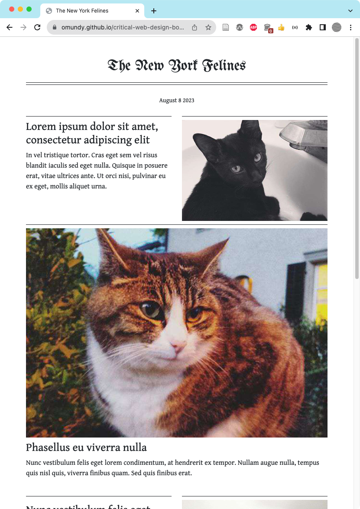
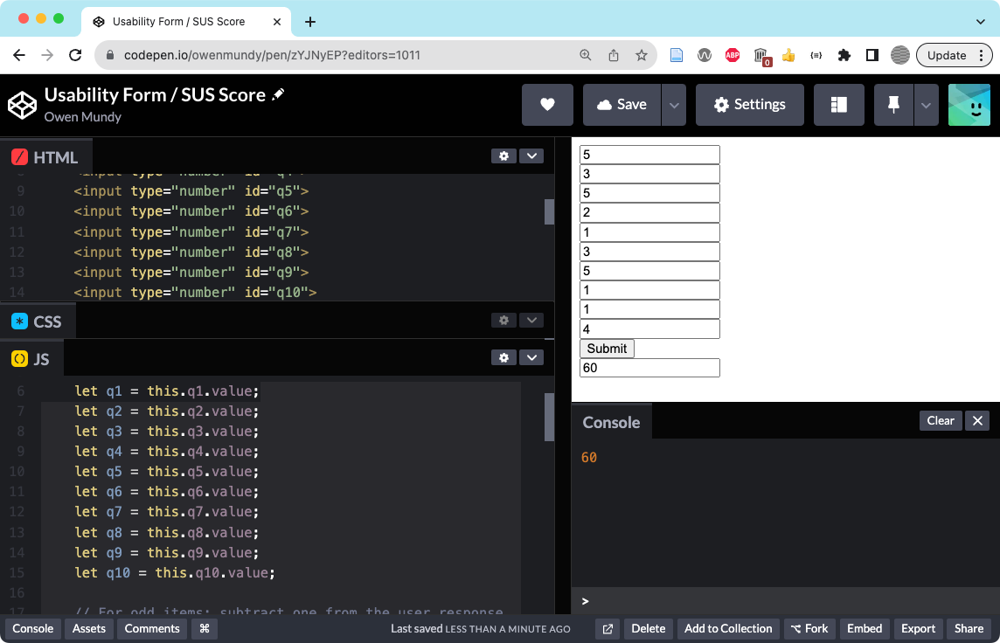
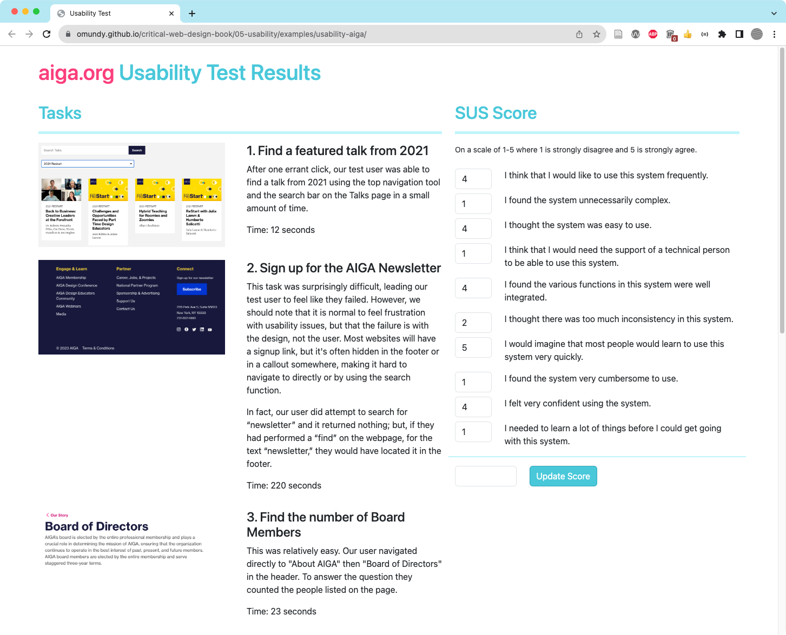
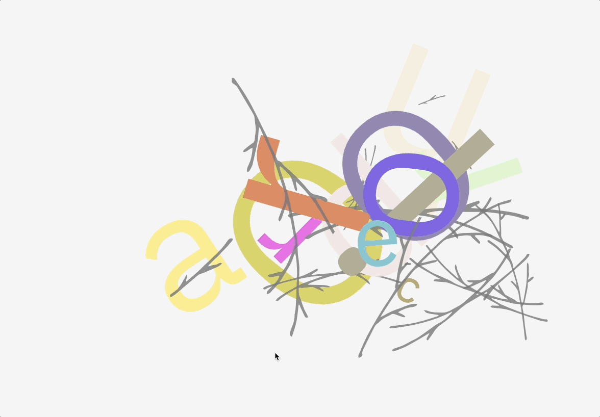

# Critical Web Design

A collection of examples and exercises to accompany _Critical Web Design_ by xtine burrough and Owen Mundy.

<!-- NOTE: Figures beginning with "ch" -->

## Chapter 1 - Networks

Publish your first web page: By the end of the modules in this chapter you will create and publish your first web page. Starting with the next exercise, you will create your Sites folder in your home directory and use the command line to navigate your hard drive in Terminal or Git Bash.

 

## Chapter 2 - View Source

Design and code a page featuring expressive typography. Start by pre-visualizing the design in Figma and then code the page using HTML, CSS, and Javascript. The text can be any glyph, a single word, or an important phrase from one of the texts at [designmanifestos.org](https://designmanifestos.org). Select a phrase that speaks to you. Examples: [After Gerhard Rühm](https://omundy.github.io/critical-web-design-book/02-view-source/examples/after-ruhm.html) | [Poem (Chaos)](https://omundy.github.io/critical-web-design-book/02-view-source/examples/poem-chaos.html) | [Poem (Click)](https://omundy.github.io/critical-web-design-book/02-view-source/examples/poem-click.html) | [Don't Be Evil)](https://omundy.github.io/critical-web-design-book/02-view-source/examples/poem-evil.html) | [Poem (Shake)](https://omundy.github.io/critical-web-design-book/02-view-source/examples/poem-shake.html) | [Poem (Think)](https://omundy.github.io/critical-web-design-book/02-view-source/examples/poem-think.html)

     

## Chapter 3 - Critical Design

Create a work of critical web design: Throughout the modules in this chapter you will redesign a logo to create a visual form incorporating commentary. You will then use Figma to iterate on design, consider typographic choices using Google Fonts, and create a web page with interactive images and Javascript to express your ideas. Examples: [Monopoly](https://omundy.github.io/critical-web-design-book/03-critical-design/examples/adobe-monopoly) | [Time](https://omundy.github.io/critical-web-design-book/03-critical-design/examples/ikea-time/)

   

## Chapter 4 - On the Grid

Design a responsive multi-column web page layout for a fictional newspaper. Use lorem ipsum placeholder text throughout your design. Code the page using the Bootstrap framework. Examples: [The New York Felines](https://omundy.github.io/critical-web-design-book/04-on-the-grid/examples/the-new-york-felines/)

    

## Chapter 5 - Usability & Forms

Create and implement a usability test, then design a responsive web page to reflect on findings. Evaluate your design using the "less is more" critique. Code the design using bootstrap, including a working web form to output the score from the System Usability Scale (SUS) survey. Examples: [AIGA usability test](https://omundy.github.io/critical-web-design-book/05-usability/examples/usability-aiga/)

<!--   -->
   

## Chapter 6 - Off the Grid

Create an experimental composition and then explode it!

Examples: [Haiku (xtine)](https://omundy.github.io/critical-web-design-book/06-off-the-grid/examples/haiku-xtine.html) | [Birds](https://omundy.github.io/critical-web-design-book/06-off-the-grid/examples/birds.html) | [Baldwin](https://omundy.github.io/critical-web-design-book/06-off-the-grid/examples/baldwin.html) | [Maintenance](https://omundy.github.io/critical-web-design-book/06-off-the-grid/examples/maintenance.html)

      

## Chapter 7 - Ethical Design

    

## Chapter 8 - Generative Design

This chapter prompt leads you to continue the work in chapter 7 by designing and coding an interactive album generator application. These exercises model the generative design prompt that follows at the end of the chapter: to create a web page that can generate new iterations of itself based on some changeable data source, like user input, time, location, etc.

